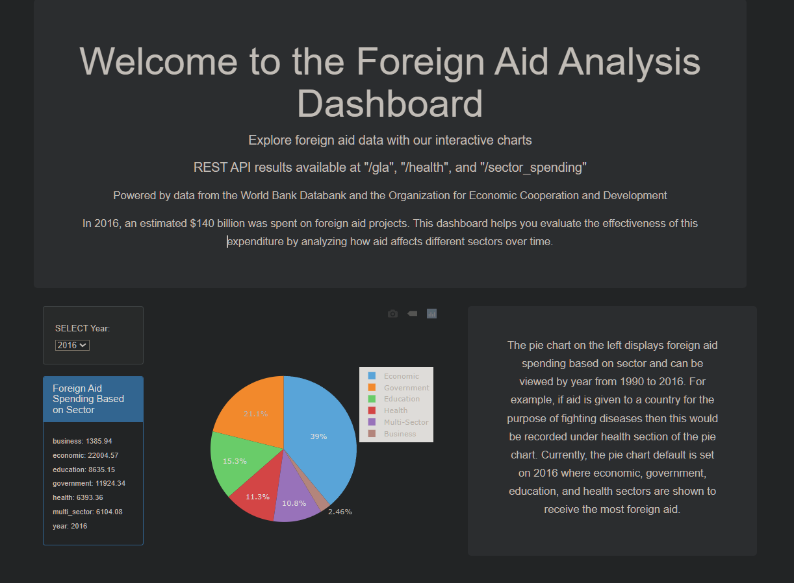
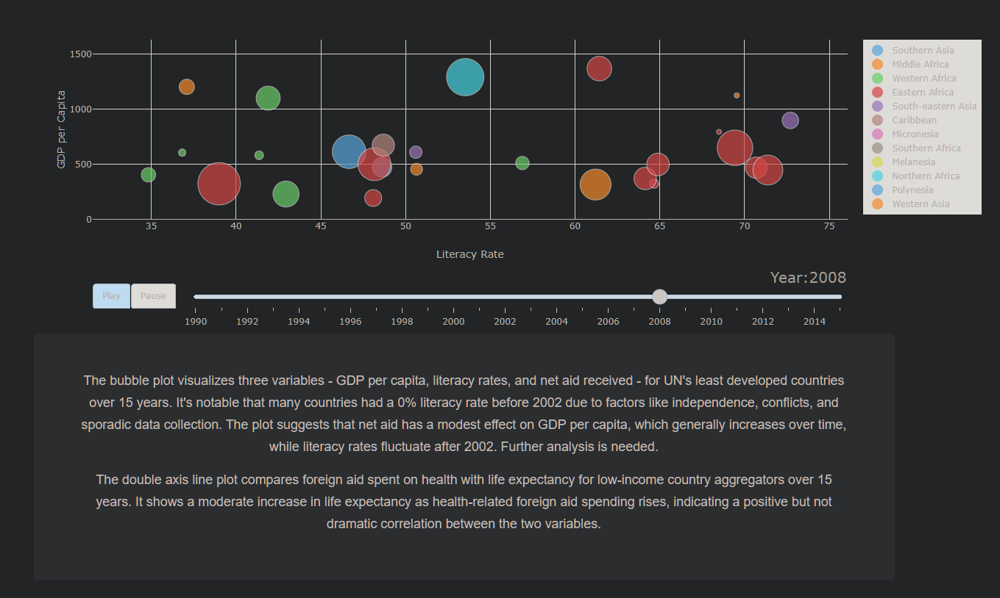
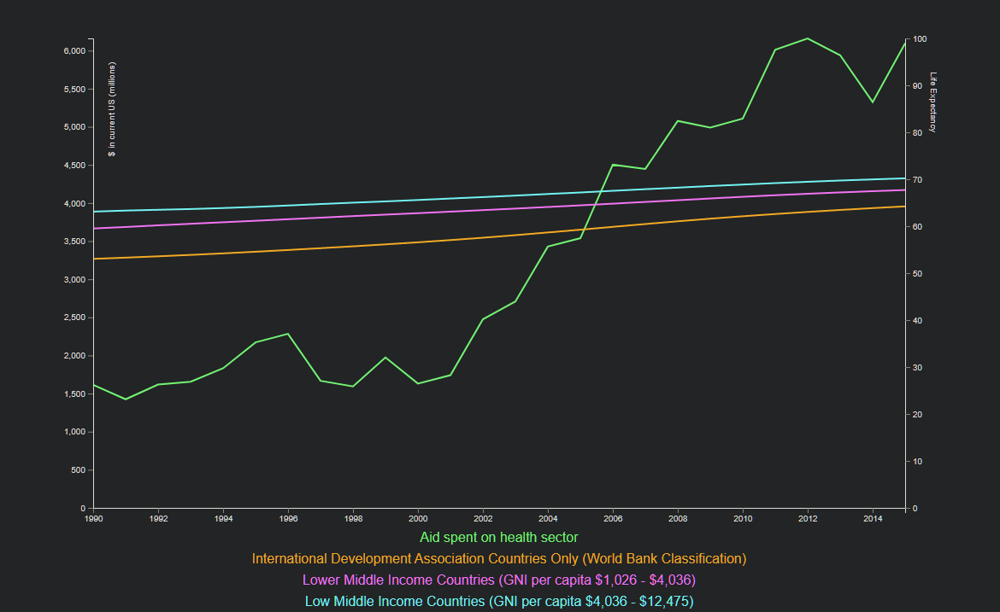

# Foreign Aid Dashboard

## Project Overview
Explore and analyze global foreign aid spending and its impact through this interactive dashboard. This repository hosts a comprehensive tool that visualizes changes in aid allocation, aid received, and key world development indicators sourced from the World Bank Databank. Dive into the data, draw meaningful insights, and gain a deeper understanding of foreign aid dynamics over time.

## Project Prview

---

---

